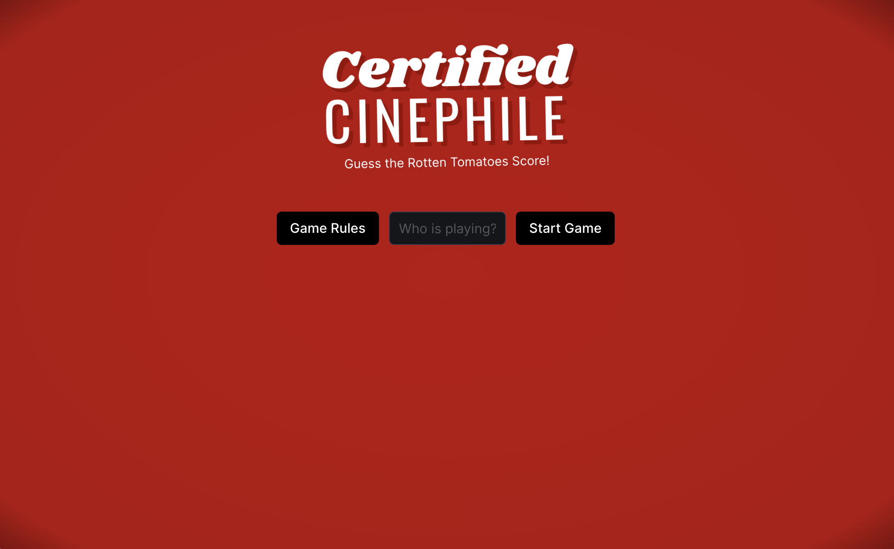
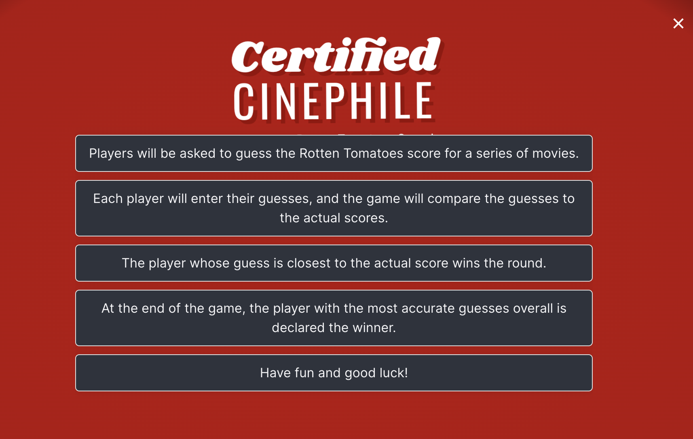
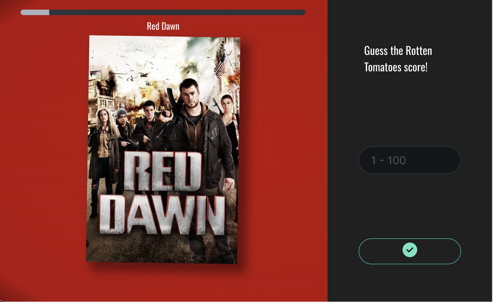
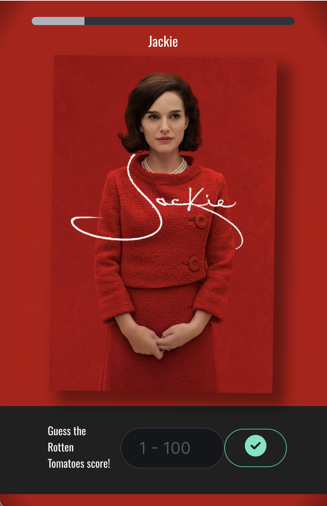

# Certified-Cinephile

## Description

Certified Cinephile is a web application that functions like a guessing game. The goal with this application was to create a fun way to test your ability to accurately estimate the Rotten Tomatoes score given a movie at random. Players are encouraged to form an educated guess based on limited information like the movie's title, poster and plot summary.

## User Story

```md
AS A fan of movies of all kinds
I want to test my ability to guess a film's Rotten Tomatoes score
WHEN I visit the Certified Cinephile web application
THEN I am greeted by a logo and clear interface
AND the rules of the game are introduced
WHEN I start the game
THEN the game loads
THEN the application will pull a selection of movies one at a time
AFTER viewing the information I have a clean interface that allows me to guess
WHEN I guess the score then I am given feedback on how accurate my guess
THIS is repeated until the game ends (10 rounds)
IF my accuracy is above a certain threshold, then I am a Certified Cinephile!
```

## Usage

To view the webpage please visit the following link.
[Link](https://a-morones.github.io/Certified-Cinephile/)

There are additional comments within the JavaScript code. There are comments throughout the GitHub repository commits.
[Link](https://github.com/a-morones/Certified-Cinephile/)

## Preview






## Credits

- Rotten Tomatoes
- The Movie Database
- Online Movie Database
- Adalberto Morones
- Tosin Ayantunji
- Christopher Vera
- Daniel Dunnemann
- mdn web docs
- W3Schools
- The Coding Boot Camp at UT Austin